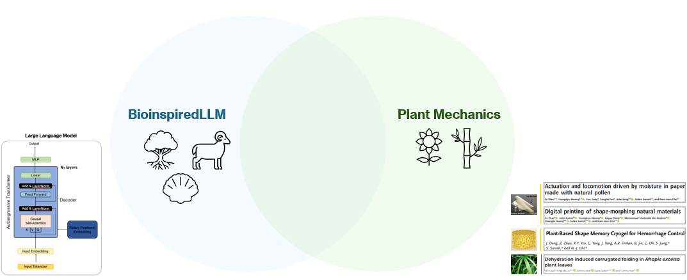
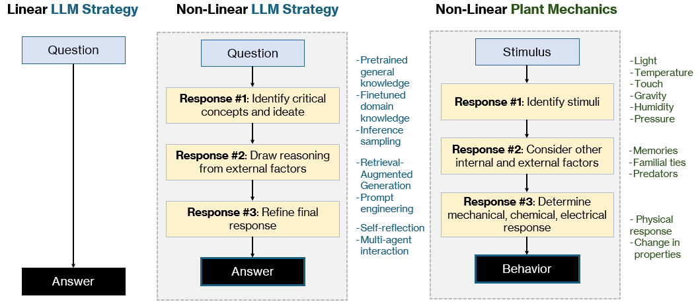
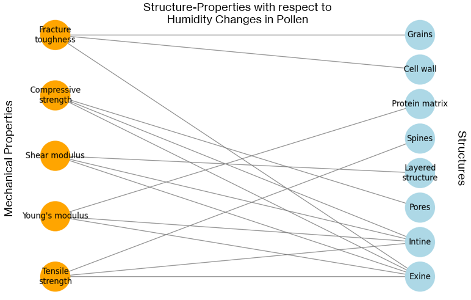
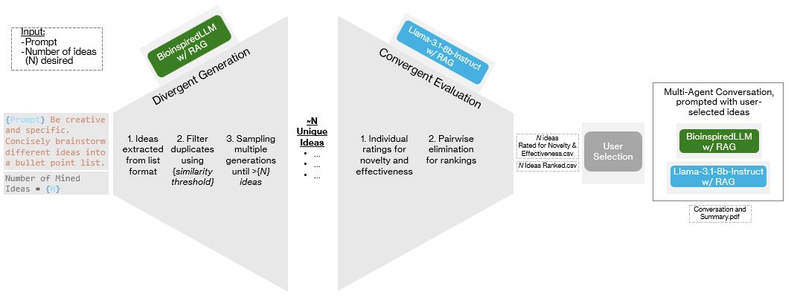

# LLMs x Plant Mechanics 🌱
*Enhancing Scientific Innovation in LLMs: A Framework Applied to Plant Mechanics Research*
*R.K. Luu, M. Dao, S. Suresh, M.J. Buehler*
*Massachusetts Institute of Technology*

## Overview 
Large Language Models (LLMs) have reshaped scientific research by providing new approaches to knowledge retrieval and content generation. However, their specific application in domain-specific scientific research, particularly in bioinspired materials science, remains underexplored. This project integrates robust LLM techniques to extract key mechanistic insights from plant materials, specifically humidity-responsive pollen-based materials and Rhapis excelsa (broadleaf lady palm) leaf mechanics. By leveraging our fine-tuned model BioinspiredLLM, Retrieval-Augmented Generation (RAG), and new sampling techniques, we generate structured hypotheses and propose bioinspired engineering structures based on plant mechanics.



With a focus on non-linear inference strategies, our approach moves beyond single-shot LLM inference, instead integrating structured multi-stage reasoning, agentic workflows, and adaptive sampling to improve creativity, interpretability, and scalability in scientific discovery.



This repository provides accessible, user-friendly notebooks that outline structured inference protocols, allowing users to:
✅ Reproduce the results from our study
✅ Apply these AI-driven protocols to new research problems
✅ Easily integrate AI-based ideation into their own workflows and research domains 

## Summary of Protocols

*Extraction of Mechanistic Insights* 
Understanding the underlying mechanisms of mechanical behavior is crucial for plant mechanics research. In this work, we demonstrate how our system can predict experimental outcomes, link structure-property relationships to inspire bioinspired designs, and extract key information to generate visualized graphs of material relationships ([Extraction of Mechanistics Insights.ipynb](notebooks/Extraction%20of%20Mechanistic%20Insights.ipynb)).



*Idea Mining*
Effective research ideation requires both diversity and refinement, following a divergent-convergent framework. In this work, we demonstrate how our system generates and filters unique, novel ideas through divergent exploration, ranks them based on scientific value in a convergent evaluation phase, ([Idea Mining - 1 DivergentConvergent.ipynb](notebooks/Idea%20Mining%20-%201%20DivergentConvergent.ipynb)) and enables further refinement through multi-agent collaboration ([Idea Mining - 2 Multi-Agent.ipynb](notebooks/Idea%20Mining%20-%202%20Multi-Agent.ipynb)), ensuring more diverse and technically grounded research directions.



*Procedure Design*
Developing effective laboratory procedures requires both technical accuracy and creative reasoning. In this work, we demonstrate how our system refines procedure generation through a multi-step approach, first establishing a scientific foundation via **Q&A generation** ([Procedure Design - 1 Q-As.ipynb](notebooks/Procedure%20Design%20-%201%20Q-As.ipynb)), then enhancing procedural depth through **multi-agent collaboration** ([Procedure Design - 2 Multi-Agent.ipynb](notebooks/Procedure%20Design%20-%202%20Multi-Agent.ipynb)), resulting in more precise and experimentally grounded protocols.

## Getting Started

Clone the repository and install required packages:

```bash
git clone https://github.com/lamm-mit/LLMsxPlants.git
cd LLMxPlants
pip install -r requirements.txt
```

## Citation
Please cite this work as: 

```bibtex
@article{XXXXXXXXX,
      title={XXXX},
      author={XXXX},
      year={2025},
      journal={XXX},
      doi={DOI},
}
