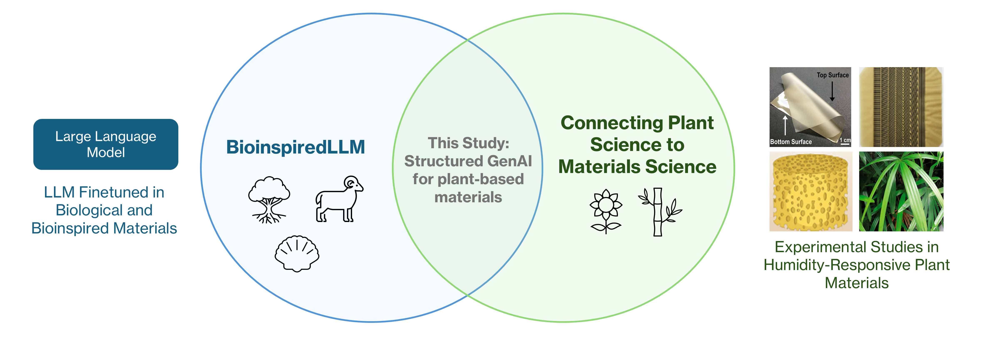
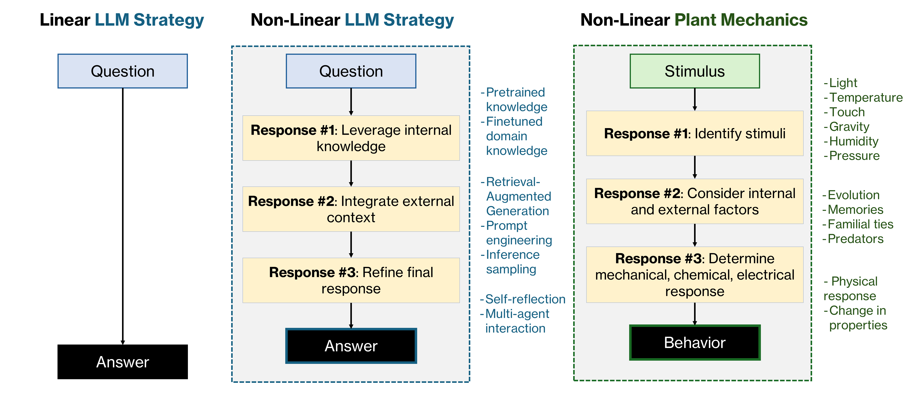
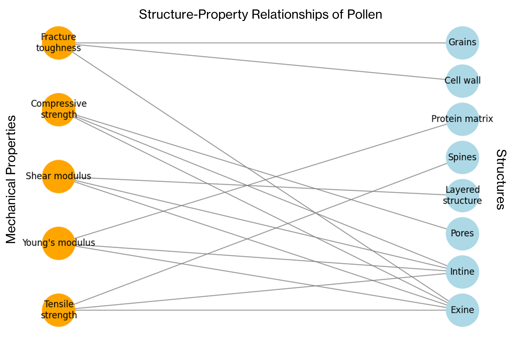
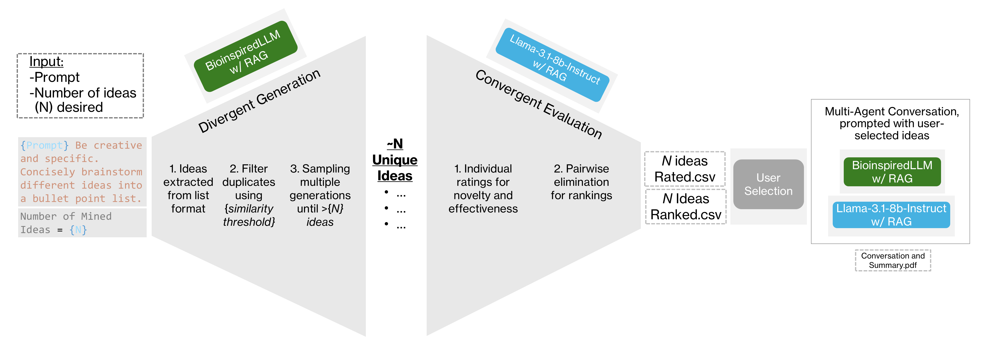
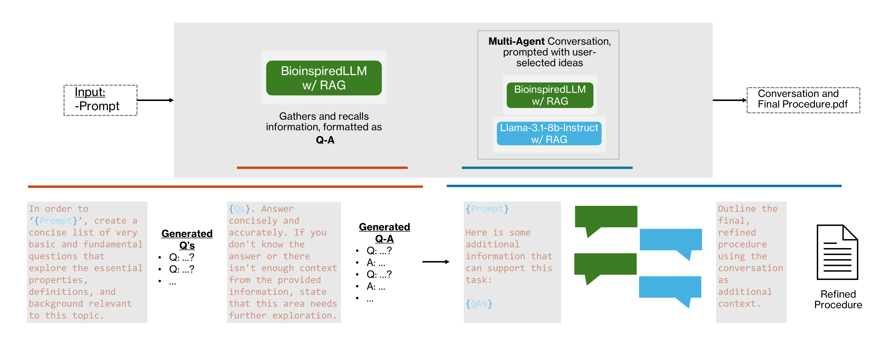

# LLMs x Plant Mechanics 🌱
GENERATIVE AI EXTRACTS STRUCTURE–FUNCTION RELATIONSHIPS FROM PLANTS FOR NEW MATERIALS <br>
*R.K. Luu, J. Deng, M.S. Ibrahim, N.J. Cho, M. Dao, S. Suresh, M.J. Buehler. (2025)*<br>
*Massachusetts Institute of Technology and Nanyang Technological University*

## Overview 
Large Language Models (LLMs) have reshaped scientific research by providing new approaches to knowledge retrieval and content generation. However, their specific application in domain-specific scientific research, particularly in biological materials science, remains underexplored. This project integrates robust LLM techniques to extract key mechanistic insights from plant materials, specifically humidity-responsive pollen-based materials and Rhapis excelsa (broadleaf lady palm) leaf mechanics. By leveraging our fine-tuned model BioinspiredLLM, Retrieval-Augmented Generation (RAG), and new sampling techniques, we generate structured hypotheses, propose bioinspired engineering structures based on plant mechanics, and validate such designs in the laboratory.



With a focus on non-linear inference strategies, our approach moves beyond single-shot LLM inference, instead integrating structured multi-stage reasoning, agentic workflows, and adaptive sampling to improve creativity, interpretability, and scalability in scientific discovery.



This repository provides accessible, user-friendly notebooks that outline structured inference protocols, allowing users to:<br>

✅ Reproduce the results from our study<br>
✅ Apply these AI-driven protocols to new research problems<br>
✅ Easily integrate AI-based ideation into their own workflows<br>

## Summary of Protocols

*Extraction of Mechanistic Insights*<br>

Understanding the underlying mechanisms of mechanical behavior is crucial for plant mechanics research. In this work, we demonstrate how our system can predict experimental outcomes, link structure-property relationships to inspire bioinspired designs, and extract key information to generate visualized graphs of material relationships ([Extraction of Mechanistics Insights.ipynb](Extraction%20of%20Mechanistic%20Insights.ipynb)).



*Idea Mining*<br>

Effective research ideation requires both diversity and refinement, following a divergent-convergent framework. In this work, we demonstrate how our system generates and filters unique, novel ideas through **divergent generation**, ranks them based on scientific value in a **convergent evaluation** phase, ([Idea Mining - 1 DivergentConvergent.ipynb](Idea%20Mining%20-%201%20DivergentConvergent.ipynb)) and enables further refinement through **multi-agent collaboration** ([Idea Mining - 2 Multi-Agent.ipynb](Idea%20Mining%20-%202%20Multi-Agent.ipynb)), ensuring more diverse and technically grounded research directions.



*Procedure Design*<br>

Developing effective laboratory procedures requires both technical accuracy and creative reasoning. In this work, we demonstrate how our system refines procedure generation through a multi-step approach, first establishing a scientific foundation via **Q&A generation** ([Procedure Design - 1 Q-As.ipynb](Procedure%20Design%20-%201%20Q-As.ipynb)), then enhancing procedural depth through **multi-agent collaboration** ([Procedure Design - 2 Multi-Agent.ipynb](Procedure%20Design%20-%202%20Multi-Agent.ipynb)), resulting in more precise and experimentally grounded protocols.



## Getting Started

Clone the repository and install required packages:

```bash
git clone https://github.com/lamm-mit/LLMsxPlants.git
cd LLMsxPlants
pip install -r requirements.txt
```
Load LLMs<br>

The finetuned LLM used is [BioinspiredLLM](https://doi.org/10.1002/advs.202306724), a Llama-3.1-8b-instruct variant. The model is stored on Hugging Face: [https://huggingface.co/lamm-mit](https://huggingface.co/lamm-mit/Llama3.1-8b-Instruct-CPT-SFT-DPO-09022024). An 8-bit quantized version is loaded for the majority of inference allowing the code to run on systems with around 8GB of RAM. Meanwhile 4-bit versions are used in multi-agent codes where two models are loaded simueltaneously for lower memory requirements. Models are loaded using LlamaIndex LlamaCPP.<br>

Load RAG<br>

RAG is supported via LlamaIndex, using `SimpleDirectoryReader` to load PDFs of research articles. Ensure the specified folder contains the relevant documents and matches the correct directory path. In our case, our RAG folder on this GitHub is empty, be sure to locate the correct papers and download their PDFs via your library credentials. 

```bash
documents = SimpleDirectoryReader(
    "./RAG/"   # Directory containing research PDFs
).load_data()
```
Load and Inference Functions<br>

All functions are defined within the notebooks for easy interpretability and can be run out of the box. The code may need to be executed in sequence for proper functionality. This setup allows users to see all code immediately, customize prompts and parameters for their specific use case, and maintain fine-tuned control over inference settings and model behavior.

## Citation
Please cite this work as: 

```bibtex
@article{luu2025generative,
  title = {Generative AI Extracts Structure–Function Relationships from Plants for New Materials},
  author = {Luu, Rachel K. and Deng, Jingyu and Ibrahim, Mohammed Shahrudin and Cho, Nam-Joon and Dao, Ming and Suresh, Subra and Buehler, Markus J.},
  institution = {Massachusetts Institute of Technology and Nanyang Technological University},
  year = {2025},
  note = {Manuscript},
  url = {[https://github.com/lamm-mit/LLMsxPlants]},
  orcid = {
    {Luu, Rachel K.}, {0000-0002-7821-934X},
    {Deng, Jingyu}, {0000-0003-2765-1906},
    {Ibrahim, Mohammed Shahrudin}, {0000-0002-3183-8581},
    {Cho, Nam-Joon}, {0000-0002-8692-8955},
    {Dao, Ming}, {0000-0001-5372-385X},
    {Suresh, Subra}, {0000-0002-6223-6831},
    {Buehler, Markus J.}, {0000-0002-4173-9659}
  }
}

